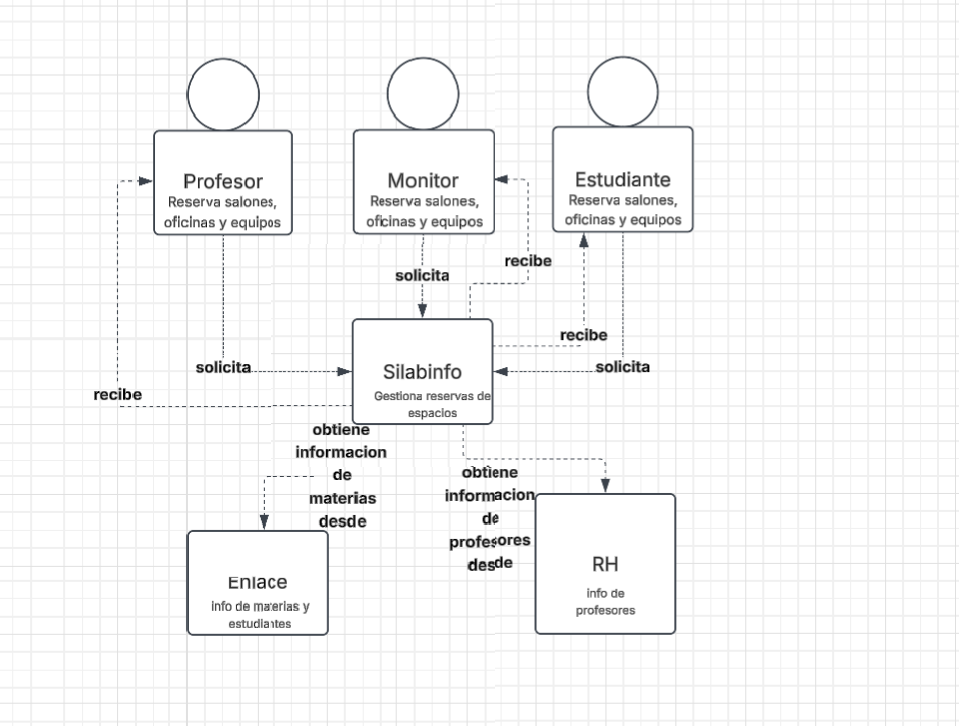

# pre-parcial

## Patrones de diseño identificados ### 1. Strategy (comportamiento) Las reglas de validación de una reserva cambian según el tipo de recurso (salón, oficina, sala de estudio, equipo). Strategy permite encapsular cada conjunto de reglas como una estrategia intercambiable, sin condicionales gigantes en el código cliente. ### 2. Adapter (estructural) Enlace y Recursos Humanos entregan la información en cadenas de texto con formato propio (id_sigla_nombre, codigo,nombre,correo). Adapter traduce esos formatos externos hacia los objetos internos que usa Silabinfo, desacoplando la lógica de negocio del formato externo.

### Diagrama de contexto 

